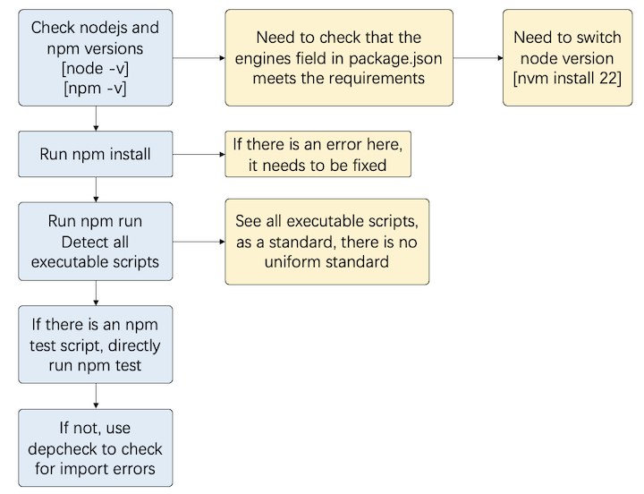

# Repo2Run_Rebuttal

Rebuttal Table 1: Analysis of 59 failed cases in Repo2Run. The first three categories (45.8%) primarily fail due to external factors, while the latter two categories (54.2%) are unable to be configured successfully within the allotted time due to excessive dependencies and extensive tests inherent to the repositories.

| Hardware Insufficiency (e.g., missing CUDA) | Missing Token (e.g., GPT Token) | Repository Defects (unable to run tests) | Dependency Installation Timeout | `runtest` Timeout |
|---------------------------------------------|---------------------------------|------------------------|---------------------------------|--------------------|
| 21 (35.6%)                                  | 1 (1.7%)                        | 5 (8.5%)               | 8 (13.5%)                       | 24 (40.7%)         |

Rebuttal Table 2: Language Support for Repo2Run Framework. It illustrates the various programming languages that can be supported by the Repo2Run framework by adjusting the base image and installation tools. This flexibility showcases the framework's capability to adapt to multiple languages, beyond just Python.
| **Programming language**      | **Docker base image**                 | **Installation tool**                    |
|---------------|--------------------------|-----------------------------|
| Python        | python:[version]         | pip                         |
| JavaScript/TypeScript    | node:[version]| npm                         |
| Ruby          | ruby:[version]           | bundler                     |
| Java          | OpenJDK:[version]        | maven                       |
| R             | r-base:[version]         | install.packages            |
| Go            | golang:[version]         | go get                      |
| PHP           | php:[version]            | composer                    |
| C/C++         | gcc:[version]            | custom build scripts        |
| Rust          | rust:[version]           | cargo                       |

Rebuttal Figure 1: Our design for applying Repo2Run to Node.js.

Rebuttal Table 3: Comparison of Dockerfile quality between Repo2Run and baseline approaches. We use hadolint to compare the Dockerfiles generated successfully by baselines and those generated by Repo2Run for the same repositories, matching the number of warnings. Fewer warnings indicate higher quality in Dockerfile generation.
| Comparison                     | Repo2Run vs. pipreqs | Repo2Run vs. LLM generator | Repo2Run vs. SWE-agent |
|--------------------------------|----------------------|----------------------------|------------------------|
| "Warning" count                | 5.17 / 6.0           | 5.42 / 10.16               | 5.43 / 6.49            |
